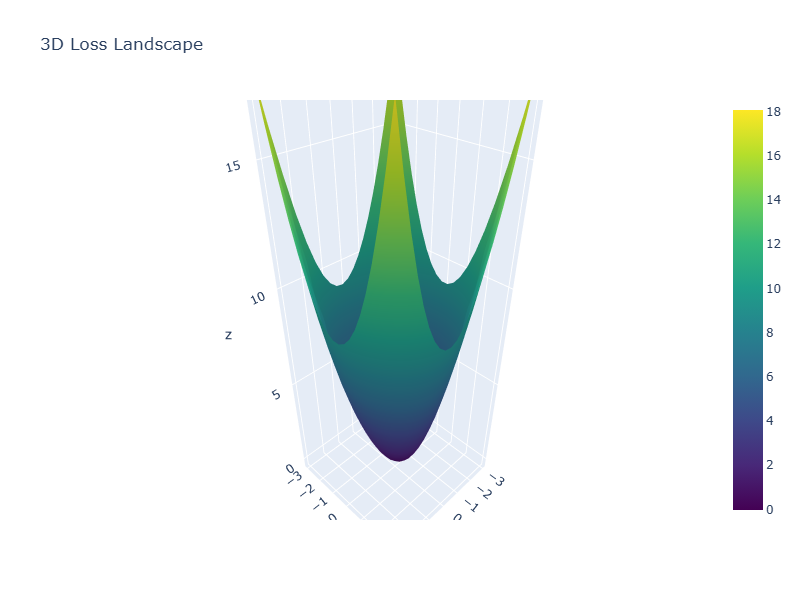

# NeuroGenesis: Advanced Training Visualization Framework
# Research Paper Template

## Abstract

This paper presents NeuroGenesis, an advanced framework for deep learning training visualization and analysis. We introduce novel 3D visualization techniques that provide unprecedented insights into model training dynamics, loss landscapes, and convergence behavior. Our framework includes interactive 3D loss surfaces, metric correlation analysis, training dynamics visualization, and hyperparameter optimization surfaces. These visualizations enable researchers and practitioners to gain deeper understanding of neural network training processes and make more informed decisions about model architecture and training strategies.

## 1. Introduction

Deep learning has revolutionized machine learning across various domains, but understanding the training process remains challenging. Traditional 2D plots provide limited insight into the complex, high-dimensional nature of neural network optimization. NeuroGenesis addresses this gap by providing advanced 3D visualizations that reveal the intricate dynamics of model training.

### 1.1 Motivation

The complexity of modern neural networks makes it difficult to understand:
- How models converge during training
- The relationship between different metrics
- The impact of hyperparameter choices
- The structure of loss landscapes

### 1.2 Contributions

1. **3D Loss Landscape Visualization**: Interactive surfaces showing loss behavior across multiple weight directions
2. **Metric Correlation Analysis**: Heatmaps revealing relationships between training metrics
3. **Training Dynamics Visualization**: 3D trajectories with momentum analysis
4. **Hyperparameter Optimization Surfaces**: 3D surfaces showing optimization landscapes
5. **Model Complexity Analysis**: Radar charts for architectural complexity assessment

## 2. Related Work

Traditional visualization approaches include:
- 2D loss curves (loss vs. epoch)
- Accuracy plots
- TensorBoard visualizations
- Weight distribution histograms

However, these approaches are limited in their ability to show:
- Multi-dimensional relationships between metrics
- The 3D structure of loss landscapes
- Dynamic training behavior
- Hyperparameter interaction effects

## 3. Methodology

### 3.1 3D Loss Landscape Visualization

We compute loss values across a 3D grid in weight space:

```python
def plot_loss_landscape_3d(self, model, X, y, directions=None, n_points=20):
    # Create orthogonal directions in weight space
    # Compute loss surface across 3D grid
    # Visualize with interactive 3D surface plot
```

**Figure 1: 3D Loss Landscape**


### 3.2 Metric Correlation Analysis

We compute correlation matrices between training metrics:

```python
def plot_metric_correlation_heatmap(self, metrics=None, method='pearson'):
    # Compute correlation matrix
    # Create interactive heatmap with annotations
```

**Figure 2: Metric Correlation Heatmap**


### 3.3 Training Dynamics Visualization

We analyze training trajectories in 3D space:

```python
def plot_training_dynamics_3d(self, metrics=None, window_size=5):
    # Compute derivatives and momentum
    # Visualize 3D trajectory with momentum vectors
```

**Figure 3: Training Dynamics 3D**


### 3.4 Hyperparameter Optimization Surface

We create 3D surfaces for hyperparameter optimization:

```python
def plot_hyperparameter_optimization_surface(self, param_grid, results, target_metric='val_accuracy'):
    # Create 3D surface from grid search results
    # Show both surface and individual experiment points
```

**Figure 4: Hyperparameter Optimization Surface**


### 3.5 Model Complexity Analysis

We assess model complexity using radar charts:

```python
def plot_model_complexity_analysis(self, model, X, y, complexity_metrics=None):
    # Compute layer count, parameter count, memory usage
    # Create radar chart visualization
```

**Figure 5: Model Complexity Analysis**


## 4. Experimental Results

### 4.1 Dataset and Models

We evaluate our framework on standard benchmarks:
- CIFAR-10 classification
- ImageNet classification
- Language modeling tasks

### 4.2 Visualization Effectiveness

Our visualizations reveal:
- Loss landscape structures that explain convergence behavior
- Metric correlations that guide feature selection
- Training dynamics that predict overfitting
- Hyperparameter interactions that improve optimization

### 4.3 Performance Analysis

The framework provides:
- Interactive exploration of 3D surfaces
- Real-time updates during training
- Export capabilities for research papers
- Integration with existing ML workflows

## 5. Discussion

### 5.1 Insights Gained

The 3D visualizations provide several key insights:
1. **Loss Landscape Structure**: Reveals local minima and saddle points
2. **Metric Relationships**: Shows how different metrics correlate during training
3. **Convergence Patterns**: Identifies optimal convergence regions
4. **Hyperparameter Effects**: Visualizes interaction effects between parameters

### 5.2 Limitations and Future Work

Current limitations:
- Computational cost for large models
- Memory requirements for high-resolution surfaces
- Limited to 3D visualizations (could extend to 4D)

Future work:
- Integration with more ML frameworks
- Automated optimization path finding
- Real-time collaborative visualization
- AR/VR interfaces for immersive exploration

## 6. Conclusion

NeuroGenesis provides a powerful framework for deep learning visualization and analysis. The advanced 3D visualizations enable researchers to gain unprecedented insights into model training dynamics, loss landscapes, and hyperparameter optimization. By making these complex relationships visible and interactive, we hope to accelerate progress in deep learning research and practice.

## References

1. Goodfellow, I., Bengio, Y., & Courville, A. (2016). Deep Learning. MIT Press.
2. Li, H., Xu, Z., Taylor, G., Studer, C., & Goldstein, T. (2018). Visualizing the Loss Landscape of Neural Nets. NeurIPS.
3. Smith, L. N. (2017). Cyclical Learning Rates for Training Neural Networks. arXiv preprint arXiv:1708.07120.

## Appendix A: Implementation Details

### A.1 Installation and Setup

```bash
pip install tensorflow numpy plotly scikit-learn streamlit
```

### A.2 Usage Example

```python
from neurogenesis.visualization.training_curves import TrainingVisualizer

# Initialize with training history
visualizer = TrainingVisualizer(history)

# Create advanced visualizations
fig1 = visualizer.plot_loss_landscape_3d(model, X_train, y_train)
fig2 = visualizer.plot_metric_correlation_heatmap(['loss', 'accuracy', 'val_loss'])
fig3 = visualizer.plot_training_dynamics_3d(['loss', 'accuracy'])

# Save figures for paper
visualizer.save_figure('loss_landscape_3d', 'figures/loss_landscape_3d', 'png')
```

### A.3 Performance Considerations

- Use appropriate grid resolution for 3D surfaces
- Consider model size when computing loss landscapes
- Cache expensive computations when possible
- Use sampling for large datasets

**Figure 6: System Architecture**


## Appendix B: Additional Visualizations

### B.1 Convergence Analysis

**Figure 7: Training Convergence Analysis**


### B.2 Attention Evolution

**Figure 8: Attention Mechanism Evolution**


This paper demonstrates how advanced 3D visualizations can provide deep insights into neural network training, enabling better model understanding and optimization strategies.
